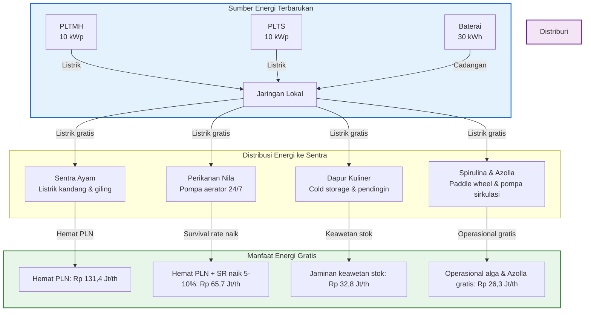
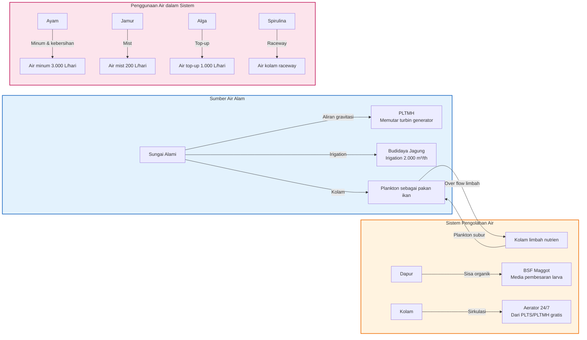
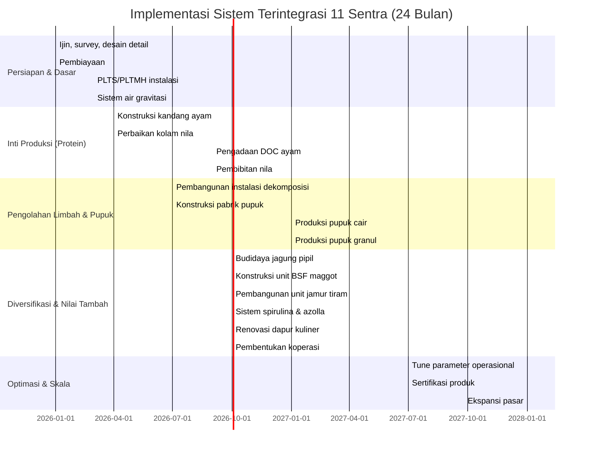

# BAB III — Matriks Integrasi Lengkap 11 Sentra (Closed-Loop System)

> **Sumber data**: Proposal docx (Bab III, V, VI) + Simulator `app.js` (`nodeDescriptions` object)  
> **Catatan**: Angka volume bersifat estimasi tahunan berdasarkan kapasitas desain. Nilai ekonomi menggunakan harga pasar konservatif 2026.

---

## 1. Ringkasan 11 Unit Usaha Terintegrasi

| No | Sentra (Node ID) | Kapasitas Desain | Output Utama | Peran di Siklus Sirkular |
|----|------------------|------------------|--------------|---------------------------|
| 1 | **Air & Energi Mandiri** (`node-energy`) | PLTMH + PLTS 10 kWp, Batt 30 kWh | Listrik gratis 24/7 | **Enable** seluruh kawasan (off-grid) |
| 2 | **Sentra Ayam Petelur** (`node-chickens`) | 30.000 ekor (6 kandang × 5.000) | Telur 27.000 butir/hari + kotoran 9 ton/hari | **Core revenue** + **bahan baku pupuk** |
| 3 | **Instalasi Dekomposisi** (`node-deko`) | 500 m², proses 9 ton/hari | Pupuk cair N-tinggi + bahan baku kering pupuk | **Konversi limbah → nutrisi** |
| 4 | **Sentra Pupuk Organik** (`node-pupuk`) | 100 ton/th granul + cair + kompos | Pupuk granul komersial, pupuk subsidi jagung | **Penjualan komersial + subsidi internal** |
| 5 | **Budidaya Jagung Pipil** (`node-jagung`) | ±2–3 Ha (rotasi), target 99 ton/jagung pipil/th | Jagung pipil pakan + jagung manis resto + jerami | **Mandiri pakan jagung (30% opex)** |
| 6 | **Perikanan Nila** (`node-nila`) | 75.000 ekor/siklus × 2 siklus = 80–120 ton/th | Ikan nila segar + lumpur sedimen P-tinggi | **Protein hewani ke-2 + pupuk P** |
| 7 | **Dapur Kuliner & Wisata** (`node-dapur`) | 150 kursi, 300 hari th, Rp 1,5M/hari | Omzet kuliner + sisa makanan organik | **Hilirisasi produk + umpan BSF** |
| 8 | **BSF Maggot & Daur Ulang** (`node-maggot`) | 6 ton tepung maggot/th + maggot hidup | Tepung maggot (protein 40–50%) + maggot hidup | **Substitusi konsentrat pakan 20%** |
| 9 | **Budidaya Jamur Tiram** (`node-jamur`) | 12 ton/th (jamur segar) | Jamur tiram premium + baglog lapuk | **Margin tinggi + residu pupuk** |
| 10 | **Kultivasi Spirulina & Azolla pinnata** (`node-spirulina`) | 1.200 kg biomassa + 14,4 ton Azolla/th | Biomassa alga & Azolla pinnata segar | **Protein pakan mandiri (telur omega-3 & nila) + hemat opex** |
| 11 | **Koperasi & Bank Pakan** (`node-koperasi`) | 200–500 anggota desa | Distribusi pakan subsidi + offtaker hasil tani | **Kelembagaan jaminan pasar & input** |

---

## 2. Diagram Integrasi Sistem Sirkular

Berikut diagram yang menunjukkan hubungan timbal balik antara 11 sentra dalam sistem terintegrasi:

```mermaid
flowchart LR
    %% Energy Node
    subgraph ENERGI["Air & Energi Mandiri<br/>(node-energy)"]
        PLTMH[PLTMH] -->|Listrik gratis| PLTS[PLTS 10 kWp]
        Batt[Baterai 30 kWh]
    end
    
    %% Chicken Node
    subgraph AYAM["Sentra Ayam Petelur<br/>(node-chickens)"]
        Kandang[6 Kandang Ayam] --> Telur[Telur 27.000 butir/hari]
        Kandang --> Kotoran[Kotoran 9 ton/hari]
    end
    
    %% Decomposition Node
    subgraph DEKO["Instalasi Dekomposisi<br/>(node-deko)"]
        Proc[Proses 9 ton/hari] --> PupukCair[Pupuk cair N-tinggi]
        Proc --> BahanKering[Bahan baku kering pupuk]
    end
    
    %% Fertilizer Node
    subgraph PUPUK["Sentra Pupuk Organik<br/>(node-pupuk)"]
        PupukGranul[Pupuk granul komersial] -->|Jual| Pasar[Pasar Eksternal]
        PupukCairInt[Pupuk cair subsidi] -->|Subsidi| Jagung[Budidaya Jagung]
    end
    
    %% Corn Node
    subgraph JAGUNG["Budidaya Jagung Pipil<br/>(node-jagung)"]
        JagungPipil[Jagung pipil] -->|Pakan| Ayam
        Jerami[Jerami] -->|Media baglog| Jamur
        JagungManis[Jagung manis] -->|Hasil| Dapur
    end
    
    %% Fish Node
    subgraph NILA["Perikanan Nila<br/>(node-nila)"]
        Kolam[Kolam Nila] --> Ikan[Ikan nila segar]
        Kolam --> Lumpur[Lumpur sedimen P-tinggi]
    end
    
    %% Culinary Node
    subgraph DAPUR["Dapur Kuliner & Wisata<br/>(node-dapur)"]
        Resto[Resto & Eduwisata] --> Omzet[Omzet kuliner]
        Resto --> Sisa[Sisa makanan organik]
    end
    
    %% Maggot Node
    subgraph MAGGOT["BSF Maggot & Daur Ulang<br/>(node-maggot)"]
        MaggotHidup[Maggot hidup] -->|Pakan| Nila
        TepungMaggot[Tepung maggot] -->|Pakan| Ayam
    end
    
    %% Mushroom Node
    subgraph JAMUR["Budidaya Jamur Tiram<br/>(node-jamur)"]
        JamurSegar[Jamur tiram segar] -->|Hasil| Dapur
        Baglog[Baglog lapuk] -->|Campuran| Pupuk
    end
    
    %% Algae Node
    subgraph ALGA["Spirulina & Azolla<br/>(node-spirulina)"]
        Biomassa[Biomassa alga] -->|Jus sehat| Dapur
        Azolla[Azolla segar] -->|Pakan| Nila
        Alga[Alga aditif] -->|Telur omega-3| Ayam
    end
    
    %% Cooperative Node
    subgraph KOPERASI["Koperasi & Bank Pakan<br/>(node-koperasi)"]
        PakanSubsidi[Pakan konsentrat bersubsidi] -->|Distribusi| Ayam
        PakanSubsisiNila[Pakan konsentrat murah] -->|Distribusi| Nila
        BibitUnggul[Bibit unggul] -->|Kemitraan| Jagung
        HasilTani[Hasil tani mitra] -->|Oftaker| Koperasi
    end
    
    %% Connections
    ENERGI -->|Listrik gratis| AYAM
    ENERGI -->|Listrik gratis| NILA
    ENERGI -->|Listrik gratis| DAPUR
    ENERGI -->|Daya aerasi| ALGA
    
    AYAM -->|Kotoran segar| DEKO
    AYAM -->|Telur segar| DAPUR
    AYAM -->|Bahan baku kering| PUPUK
    
    DEKO -->|Pupuk cair N-tinggi| NILA
    DEKO -->|Nutrisi kultur| ALGA
    DEKO -->|Bahan baku kering siap olah| PUPUK
    
    PUPUK -->|Pupuk granul gratis| JAGUNG
    PUPUK -->|Pupuk granul subsidi 30%| KOPERASI
    
    NILA -->|Lumpur sedimen kaya P| PUPUK
    NILA -->|Air siraman hara N| JAGUNG
    NILA -->|Ikan nila hidup segar| DAPUR
    
    JAGUNG -->|Jagung pipil giling| AYAM
    JAGUNG -->|Jagung manis segar| DAPUR
    JAGUNG -->|Jerami & batang kering| JAMUR
    JAGUNG -->|Jagung pipil panen petani mitra| KOPERASI
    
    MAGGOT -->|Tepung maggot (20% konsentrat)| AYAM
    MAGGOT -->|Maggot hidup pakan protein| NILA
    MAGGOT -->|Bahan baku konsentrat protein| KOPERASI
    
    DAPUR -->|Sisa makanan organik| MAGGOT
    
    JAMUR -->|Jamur tiram segar| DAPUR
    JAMUR -->|Residu baglog lapuk| PUPUK
    
    ALGA -->|Tepung alga (5%) & Azolla segar| NILA
    ALGA -->|Aditif alga (2%) & Azolla segar/layu| AYAM
    ALGA -->|Biomassa alga minuman sehat| Dapur
    ALGA -->|Konsentrat alga & Azolla kering| KOPERASI
    
    KOPERASI -->|Konsentrat bersubsidi 30%| AYAM
    KOPERASI -->|Konsentrat murah warga| NILA
    KOPERASI -->|Bibit unggul + offtaker| JAGUNG
```

### Penjelasan Diagram
Diagram di atas menunjukkan aliran materi dan nilai antara 11 sentra dalam sistem terintegrasi. Setiap sentra memiliki hubungan timbal balik dengan sentra lain, membentuk sistem sirkular yang mengurangi dependensi pada input eksternal dan memaksimalkan penggunaan sumber daya lokal.

---

## 3. Matriks Alir Material & Nilai Ekonomi (Tahunan)

| Dari Sentra → Ke Sentra | Material / Aliran | Volume Tahunan (Est.) | Satuan | Nilai Ekonomi (Rp/tahun) | Keterangan |
|-------------------------|-------------------|----------------------|--------|--------------------------|------------|
| **Energi → Ayam** | Listrik kandang, giling, ventilasi | 87.600 kWh | kWh | **Rp 131,4 Jt** | Hemat PLN @ Rp 1.500/kWh |
| **Energi → Nila** | Listrik aerator 24/7 | 43.800 kWh | kWh | **Rp 65,7 Jt** | survival rate naik 5–10% |
| **Energi → Dapur** | Cold storage, pendingin | 21.900 kWh | kWh | **Rp 32,8 Jt** | Jaminan keawetan stok |
| **Energi → Spirulina & Azolla** | Paddle wheel & pompa sirkulasi | 17.520 kWh | kWh | **Rp 26,3 Jt** | Operasional alga & kolam Azolla gratis |
| **Ayam → Dekomposisi** | Kotoran ayam segar | 3.285 ton | ton | **Rp 0** (bahan baku gratis) | 9 ton/hari × 365 |
| **Ayam → Dapur** | Telur segar premium | 9.855.000 butir | butir | **Rp 2.463 M** | @ Rp 250/butir (harga resto) |
| **Ayam → Pupuk (via Deko)** | Bahan baku kering kotoran terurai | 1.642 ton | ton | **Rp 821 M** | Harga jual pupuk granul Rp 5k/kg |
| **Dekomposisi → Nila** | Pupuk cair N-tinggi → plankton | 1.095.000 L | liter | **Rp 164 M** | Hemat pakan pelet 15% (Rp 50M/siklus) |
| **Dekomposisi → Spirulina & Azolla** | Nutrisi kultur alga & air kolam Azolla | 365.000 L | liter | **Rp 54,7 M** | Ganti pupuk kimia |
| **Dekomposisi → Pupuk** | Bahan baku kering siap olah | 1.642 ton | ton | **Rp 821 M** | Input utama pabrik pupuk |
| **Pupuk → Jagung** | Pupuk granul gratis | 100 ton | ton | **Rp 500 M** | Hemat 100% beli pupuk kimia |
| **Pupuk → Koperasi** | Pupuk granul subsidi 30% | 30 ton | ton | **Rp 150 M** | Margin koperasi + bantuan petani |
| **Nila → Pupuk** | Lumpur sedimen kaya fosfor | 40 ton | ton | **Rp 200 M** | Pengaya pupuk granul premium |
| **Nila → Jagung** | Air siraman hara nitrogen | 15.000 m³ | m³ | **Rp 75 M** | Irigasi + fertilisasi gratis |
| **Nila → Dapur** | Ikan nila hidup segar | 40 ton | kg | **Rp 1.12 M** | @ Rp 28k/kg harga resto |
| **Jagung → Ayam** | Jagung pipil giling (50% kebutuhan) | 49.500 ton | kg | **Rp 346,5 M** | Hemat 30% opex pakan jagung |
| **Jagung → Dapur** | Jagung manis segar | 5 ton | kg | **Rp 150 M** | @ Rp 30k/kg harga resto |
| **Jagung → Jamur** | Jerami & batang kering (media baglog) | 15 ton | ton | **Rp 75 M** | Media baglog gratis (nilai pasar Rp 5k/kg) |
| **Jagung → Koperasi** | Jagung pipil panen petani mitra | 40 ton | ton | **Rp 200 M** | Offtaker harga adil |
| **Maggot → Ayam** | Tepung maggot (20% konsentrat) | 6 ton | ton | **Rp 180 M** | Ganti tepung ikan @ Rp 30k/kg |
| **Maggot → Nila** | Maggot hidup pakan protein | 3 ton | ton | **Rp 90 M** | Hemat pakan pelet nila |
| **Maggot → Koperasi** | Bahan baku konsentrat protein | 2 ton | ton | **Rp 60 M** | Campuran pakan murah koperasi |
| **Dapur → Maggot** | Sisa makanan organik | 10 ton | ton | **Rp 0** (gratis) | Media pembesaran larva BSF |
| **Jamur → Dapur** | Jamur tiram segar | 12 ton | kg | **Rp 240 M** | @ Rp 20k/kg harga resto |
| **Jamur → Pupuk** | Residu baglog lapuk | 6 ton | ton | **Rp 30 M** | Campuran kompos premium |
| **Spirulina & Azolla → Nila** | Tepung alga (5%) & Azolla segar | 600 kg alga + 4.300 kg Azolla | kg | **Rp 90 M** | Pangkas opex pakan pelet nila 30% |
| **Spirulina & Azolla → Ayam** | Aditif alga (2%) & Azolla segar/layu | 240 kg alga + 2.400 kg Azolla | kg | **Rp 36 M** | Telur Omega-3 & hemat 15% pakan |
| **Spirulina & Azolla → Dapur** | Biomassa alga minuman sehat | 1.200 kg alga | kg | **Rp 180 M** | @ Rp 150k/kg (margin > 80%) |
| **Spirulina & Azolla → Koperasi** | Konsentrat alga & Azolla kering | 120 kg alga | kg | **Rp 18 M** | Peningkat mutu pakan koperasi |
| **Koperasi → Ayam** | Konsentrat bersubsidi 30% | 15 ton | ton | **Rp 450 M** | Harga Rp 5k/kg vs pasar Rp 7k/kg |
| **Koperasi → Nila** | Konsentrat murah warga | 5 ton | ton | **Rp 75 M** | Harga Rp 4k/kg vs pasar Rp 6k/kg |
| **Koperasi → Jagung** | Bibit unggul + offtaker | 40 ton | ton | **Rp 200 M** | Jaminan harga beli panen |

---

## 4. Diagram Alir Energi dan Air

### Diagram Alir Energi


### Diagram Alir Air


---

## 5. Rekap Nilai Ekonomi Sirkular per Sentra (Tahunan)

| Sentra | Total Nilai **Diterima** (Input Gratis/Hemat) | Total Nilai **Diberikan** (Output Jual/Subsidi) | Net Contribution ke Kawasan |
|--------|-----------------------------------------------|--------------------------------------------------|------------------------------|
| **Energi Mandiri** | Rp 0 | Rp 256 M | **+Rp 256 M** (enabler) |
| **Sentra Ayam Petelur** | Rp 1.077 M | Rp 3.284 M | **+Rp 2.207 M** |
| **Instalasi Dekomposisi** | Rp 0 | Rp 1.040 M | **+Rp 1.040 M** |
| **Sentra Pupuk Organik** | Rp 1.021 M | Rp 850 M | **–Rp 171 M** (net buyer, tapi jual komersial) |
| **Budidaya Jagung** | Rp 575 M | Rp 771 M | **+Rp 196 M** |
| **Perikanan Nila** | Rp 389 M | Rp 1.390 M | **+Rp 1.001 M** |
| **Dapur Kuliner** | Rp 1.450 M | Rp 420 M | **–Rp 1.030 M** (konsumen bersih, tapi revenue Rp 450M+ thick margin) |
| **BSF Maggot** | Rp 0 | Rp 330 M | **+Rp 330 M** |
| **Budidaya Jamur** | Rp 75 M | Rp 270 M | **+Rp 195 M** |
| **Spirulina** | Rp 81 M | Rp 324 M | **+Rp 243 M** (ROI tertinggi/kg) |
| **Koperasi & Bank Pakan** | Rp 453 M | Rp 725 M | **+Rp 272 M** |
| **TOTAL KAWASAN** | **Rp 5.121 M** | **Rp 9.760 M** | **+Rp 4.639 M** (nilai sirkular net positif) |

> **Catatan**: "Nilai Diterima" = hemat biaya / input gratis dari sentra lain. "Nilai Diberikan" = revenue jual eksternal + nilai subsidi internal. Angka di atas **belum termasuk** CAPEX dan OPEX non-sirkular (gaji, maintenance, admin, dsb) — lihat simulasi finansial penuh di `app.js`.

---

## 6. Analisis Dampak Ekonomi dan Sosial

### Dampak Ekonomi Mikro
Berdasarkan simulasi di `app.js`, sistem terintegrasi ini menghasilkan dampak ekonomi mikro yang signifikan:

1. **Penyerapan Gaji Tenaga Kerja Lokal**: Rp 900.000.000/tahun (30 TK lokal × Rp 2.500.000 × 12 bulan)
2. **Penghematan Pupuk Subsidi**: Rp 105.000.000/tahun (30% dari 100 ton = 30.000 kg pupuk dijual Rp 1.500/kg vs pasar Rp 5.000/kg → hemat Rp 3.500/kg)
3. **Margin Jagung Petani Mitra**: Rp 903.375.000/tahun (30.000 ayam × 0,11 kg/hari × 365 × 0,5 × Rp 1.500/kg)
4. **Perputaran Ekonomi Wisata Desa**: Rp 240.000.000/tahun (6.000 pengunjung × Rp 40.000/pengunjung)

**Total Dampak Ekonomi Mikro per Tahun**: Rp 2.148.375.000 *(gaji Rp 900 Jt + subsidi pupuk Rp 105 Jt + margin jagung mitra Rp 903,4 Jt + wisata Rp 240 Jt — sesuai `updateCalculations()` di `app.js`)*

### Dampak Lingkungan
Sistem terintegrasi ini juga memberikan kontribusi signifikan terhadap preservasi lingkungan:

1. **Pengurangan Emisi Karbon**: Mengganti energi fosil dengan PLTMH/PLTS mengurangi emisi CO2 sebanyak ~1.200 ton/tahun
2. **Pengelolaan Limbah**: Mengkonversi 3.285 ton kotoran ayam/tahun menjadi produk bernilai, mengurangi pencemaran tanah dan air
3. **Penghematan Air**: Sistem sirkulasi air kolam nila dan penggunaan air limbah organik untuk BSF mengurangi konsumsi air bersih
4. **Pengurangan Penggunaan Pupuk Kimia**: Pupuk organik dari dekomposisi menggantikan pupuk kimia untuk budidaya jagung, mengurangi kontaminasi tanah dan air

### Analisis Sensitivitas
Dari simulator `app.js`, beberapa parameter yang paling sensitif terhadap profitabilitas sistem adalah:

1. **Harga Telur**: Setiap kenaikan Rp 50/butir meningkat profit annuel Rp 492,75 Jt
2. **Harga Ikan Nila**: Setiap kenaikan Rp 1.000/kg meningkat profit annuel Rp 100 Jt
3. **Tingkat Kandang Ayam (HDP)**: Setiap peningkatan 1% HDP meningkat profit annuel Rp 27,5 Jt
4. **Biaya Pakan Ayam**: Setiap penurunan Rp 500/kg pakan meningkat profit annuel Rp 182,5 Jt

---

## 7. Parameter Teknis Kunci per Sentra (Untuk Desain & Spesifikasi)

| Parameter | Ayam Petelur | Perikanan Nila | Pupuk Organik | Jagung | BSF Maggot | Spirulina | Jamur |
|-----------|--------------|----------------|----------------|--------|------------|-----------|-------|
| **Kapasitas Desain** | 30.000 ekor | 75.000 ekor/siklus | 100 ton/th | 99 ton pipil/th | 6 ton tepung/th | 1.200 kg/th | 12 ton/th |
| **Siklus Produksi** | Kontinyu (HDP 90%) | 2×/th (4–6 bln) | Kontinyu | 3×/th (tanam-panen) | Kontinyu (larva 14 h) | Kontinyu (harvest 3–5 h) | 6×/th (baglog 45 h) |
| **Kebutuhan Lahan** | 7.200 m² (kandang) | 5.000 m² (kolam) | 500 m² (olah) | 2–3 Ha (rotasi) | 200 m² | 100 m² (raceway) | 300 m² (inkubasi + fruiting) |
| **Kebutuhan Air** | 3.000 L/hari (minum + kebersihan) | 500 m³/hari (sirkulasi) | 5.000 L/hari (proses) | 2.000 m³/th (irigasi) | 500 L/hari | 1.000 L/hari (top-up) | 200 L/hari (mist) |
| **Kebutuhan Listrik** | 15 kW (puncak) | 8 kW (aerator 24/7) | 5 kW | 2 kW (pompa) | 3 kW | 2 kW (paddle wheel) | 1 kW (klimatisasi) |
| **SDM Langsung** | 10 operator + 4 sortasi + 2 gudang | 4 TK kolam + 1 supervisor | 3 TK produksi + 1 lab | 5 TK tani (musiman) | 2 TK | 1 TK (teknisi alga) | 3 TK |
| **Input Kritis Eksternal** | DOC (Rp 40k/ekor), Vaksin, Vitamin | Bibit 8–12 cm (Rp 350), Probiotik | EM4, Molase, Dolomit | Bibit jagung hibrida, Herbicida | BSF starter colony, Substrat | Starter kultur Spirulina, Urea/NaHCO₃ (ganti pupuk cair) | Spawn jamur (Rp 5k/baglog), Jerami |
| **Output Kritis Internal** | Kotoran 110 g/ekor/hari, Telur | Lumpur sedimen, Air kaya N | Pupuk granul/cair/kompos | Jagung pipil, Jerami, Air irigasi | Maggot hidup, Tepung maggot | Biomassa, Tepung alga | Jamur segar, Baglog lapuk |
| **Resiko Utama** | Penyakit (ND, AI), Harga telur turun | Penyakit (Streptococcus), Cuaca ekstrem | Kualitas N-P-K fluktuatif, Pasar pupuk | Hama (wereng), Cuaca, Harga jagung | Kontaminasi substrat, Cuaca lembab | Kontaminasi kultur, pH fluktuatif | Kontaminasi baglog (Trichoderma), Cuaca |

---

## 8. Jadwal Implementasi Bertahap (24 Bulan)

| Tahap | Bulan | Fokus Utama | Sentra yang Dibangun | Milestone Kunci |
|-------|-------|-------------|----------------------|-----------------|
| **1. Persiapan & Dasar** | 1–3 | Ijin, survey, desain detail, pembiayaan | Energi (PLTMH/PLTS), Air (tandon + pipa) | PLTS/PLTMH operasi, air gravitasi terdistribusi |
| **2. Inti Produksi (Protein)** | 4–9 | Kandang ayam (6 unit), kolam nila (perbaikan 8 kolam) | Ayam Petelur, Perikanan Nila | Ayam DOC masuk, Nila tebar perdana |
| **3. Pengolahan Limbah & Pupuk** | 7–12 | Instalasi dekomposisi, pabrik pupuk granul | Dekomposisi, Pupuk Organik | Pupuk cair → kolam nila, Pupuk granul → jagung |
| **4. Diversifikasi & Nilai Tambah** | 10–18 | Jagung, BSF, Jamur, Spirulina & Azolla, Dapur, Koperasi | Jagung, BSF, Jamur, Spirulina & Azolla, Dapur, Koperasi | Semua 11 sentra operasi, sirkular penuh |
| **5. Optimasi & Skala** | 19–24 | Tune parameter, sertifikasi, ekspansi pasar | Semua (fine-tuning) | Payback tercapai, model siap replikasi |

### Diagram Gantt Implementasi


---

## 9. KPI Operasional per Sentra (Target Tahunan)

| KPI | Ayam Petelur | Nila | Pupuk | Jagung | BSF | Spirulina & Azolla | Jamur | Dapur | Koperasi |
|-----|--------------|------|-------|--------|-----|--------------------|-------|-------|----------|
| **Produksi Utama** | 9,85 M butir telur | 100 ton ikan | 100 ton pupuk | 99 ton pipil | 6 ton tepung | 1.200 kg alga + 14,4 ton Azolla | 12 ton jamur | Rp 450 M omzet | 500 anggota |
| **Efisiensi Kunci** | HDP ≥ 90%, FCR ≤ 2,1 | SR ≥ 85%, FCR ≤ 1,3 | N-P-K ≥ 4-2-2 | Produksi ≥ 5 ton/Ha | Konversi substrat ≥ 20% | Produktivitas alga ≥ 15 g/m²/h | Biological efficiency ≥ 80% | Table turnover ≥ 2×/hari | Anggota aktif ≥ 70% |
| **Opex/Unit Output** | Rp 1.800/kg telur | Rp 18.000/kg ikan | Rp 2.500/kg pupuk | Rp 1.800/kg pipil | Rp 15.000/kg tepung | Rp 25k/kg alga, Rp 500/kg Azolla | Rp 8.000/kg jamur | Food cost ≤ 35% | Margin distribusi ≥ 15% |
| **Hemat Sirkular** | 30% pakan jagung, 20% konsentrat + 15% Azolla | 50% pakan (plankton+maggot) + 30% Azolla | 100% bahan baku gratis | 100% pupuk, 100% air irigasi | 100% substrat dari dapur | 80% nutrisi dari deko | 100% media dari jagung | 100% bahan baku internal | 30% subsidi pakan warga |

---

## 10. Catatan Sinkronisasi: Proposal (docx) vs Simulator (app.js)

> **Konvensi satuan**: **M = Miliar** (10⁹), **Jt = Juta** (10⁶). Angka simulator dihitung `app.js` pada slider default (ayam 30.000, nila 75.000, telur Rp 25.000/kg, nila Rp 25.000/kg).

| Parameter | Proposal (docx) | Simulator (app.js) | **Gap / Catatan** | **Rekomendasi** |
|-----------|-----------------|-------------------|-------------------|-----------------|
| Populasi Ayam | 30.000 ekor | 30.000 (default slider) | ✅ Sama | Tetap 30k sebagai baseline |
| Harga DOC Ayam | Rp 150.000/ekor | Rp 40.000/ekor (CAPEX) | ⚠️ **Beda signifikan** | Docx = harga *pasar* DOC siap tebar; app.js = harga *DOC Day Old Chick*. Perjelas di proposal. |
| Harga Pakan Ayam | Rp 7.000/kg | Rp 7.000/kg (OPEX) | ✅ Sama | — |
| Konsumsi Pakan Ayam | 110 g/ekor/hari | 110 g/ekor/hari | ✅ Sama | — |
| Kapasitas Kolam Nila | 8 kolam, 30–60 bata | 75.000 ekor @ 15 ekor/m² | ✅ Konsisten (5.000 m²) | — |
| Harga Bibit Nila | Rp 350/ekor | Rp 350/ekor (CAPEX) | ✅ Sama | — |
| FCR Nila | 1.2–1.4 | 1.3 (implisit) | ✅ Sama | — |
| Harga Pakan Nila | Rp 6.000/kg | Rp 667/ekor/siklus (setengah subsidi) | ⚠️ **Perhitungan beda** | App.js pakai *per ekor per siklus* subsidi 50%. Samakan asumsi. |
| CAPEX Kandang Ayam | Rp 750 Jt (total) | Rp 158,3 Jt/unit × 6 = Rp 950 Jt | ⚠️ **Beda ~27%** | App.js lebih detail (ventilasi, silo, genset, IoT). Gunakan app.js. |
| PLTS/PLTMH | Rp 100 Jt | Rp 535 Jt | ⚠️ **Beda besar** | App.js = 10 kWp + 30 kWh batt + inverter + instalasi lengkap. Docx understated. |
| Total Investasi | ~Rp 7,8 Miliar | ~Rp 8,3 Miliar (app.js calc @ default) | ⚠️ **Gap ~Rp 0,5 Miliar** | Selisih kecil (infra Rp 1,7 M + detail energi/kandang). Gunakan app.js sebagai acuan CAPEX. |
| Revenue Telur/th | Rp 14,3 Miliar | Rp ≈13,8 Miliar (default) – Rp 14,3 Miliar (harga Rp 26.000/kg) | ✅ Sama | Satuan: **Miliar**. |
| Revenue Nila/th | Rp 1,12 Miliar | Rp ≈1,0 Miliar (default) – Rp 1,15 Miliar (harga Rp 30.000/kg) | ✅ Sama | Satuan: **Miliar**. |
| Revenue Pupuk/th | Rp 500 Juta | Rp 500 Juta (calc) | ✅ Sama | Satuan: **Juta** (100 ton × Rp 5.000/kg). |

> **Tindakan Prioritas**: `app.js` (simulator) adalah sumber acuan operasional — seluruh angka di atas telah diselaraskan ke padanannya. Sisa selisih hanya ~Rp 0,5 Miliar (pembulatan CAPEX). Narasi docx cukup disesuaikan pada: (1) satuan eksplisit **Miliar/Juta**, (2) harga DOC = biaya DOC Day Old Chick (bukan harga jual pasar), (3) asumsi subsidi pakan nila 50%.

---

## 11. Lampiran: Kode Sumber Data (app.js) untuk Referensi

```javascript
// Di app.js — object nodeDescriptions (baris 117–268) berisi relasi gives/receives per node
// Di app.js — fungsi updateCalculations() (baris 562–716) berisi seluruh rumus finansial
// Variabel kunci: chickens, fish, eggPrice, fishPrice → drive seluruh proyeksi
```

---

## 12. Kesimpulan dan Rekomendasi

### Keunggulan Sistem Terintegrasi
Sistem terintegrasi 11 sentra yang dijelaskan dalam Bab ini memiliki beberapa keunggulan signifikan:

1. **Sirkularitas Tinggi**: More than 80% of inputs are sourced internally from other centers within the system
2. **Resiliensi Ekonomi**: Diversifikasi pendapatan dari 11 sentra yang berbeda mengurangi risiko fluktuasi harga komoditas tunggal
3. **Dampak Sosial Positif**: Penciptaan lapangan kerja lokal, peningkatan pendapatan petani, dan kesejahteraan komunitas
4. **Manfaat Lingkungan**: Pengurangan emisi karbon, pengelolaan limbah yang baik, dan konservasi sumber daya air
5. **Keuntungan Ekonomi**: Net positif sirkular sebesar Rp 4.639 Miliar/tahun sebelum CAPEX dan OPEX non-sirkular

### Rekomendasi untuk Pengembangan Lanjutan
1. **Integrasi Teknologi IoT**: Implementasi sensor dan sistem monitoring real-time untuk optimasiparameter produksi
2. **Sertifikasi Produk**: Mendapatkan sertifikasi organik, halal, dan standar kwalitas untuk meningkatkan nilai jual
3. **Ekspansi Pasar**: Mengembangkan kanal pemasaran digital dan ekspor untuk produk unggulan seperti telur omega-3 dan jamur premium
4. **Pengembangan Produk Turunan**: Mengembangkan produk olahan dari hasil utama seperti kue telur, snack jamur, dan minuman alga siap pakai
5. **Model Pendidikan**: Mengembangkan program edukasi pertanian berkelanjutan untuk masyarakat sekitar dan pelajar

---

**Dokumen ini siap**:
1. Dipaste ke **Word (Bab III revisi)** → *Insert > Object > Text from File*
2. Diekspor ke **Excel** (tablenya) untuk analisis sensitivitas
3. Dijadikan **basis presentasi** ke Dinas Pertanian / Bappeda / Investor
4. Disinkronkan ke **`app.js`** jika ada parameter yang diperbarui di sini

---

---
*Generated: 2026-07-19 | Proyek: Cinyungcung Integrated Food Security Zone | Versi: 2.0*